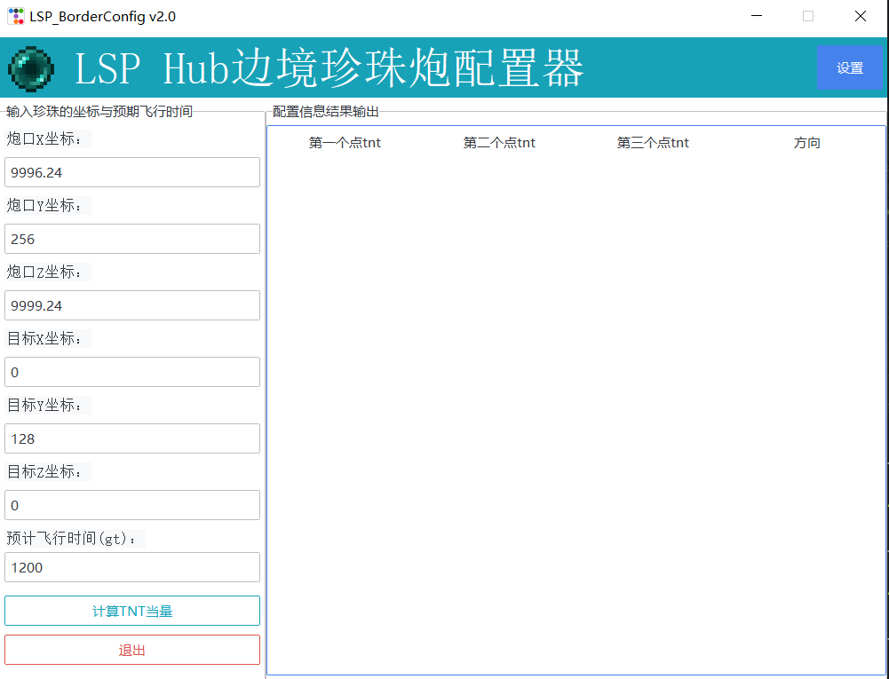
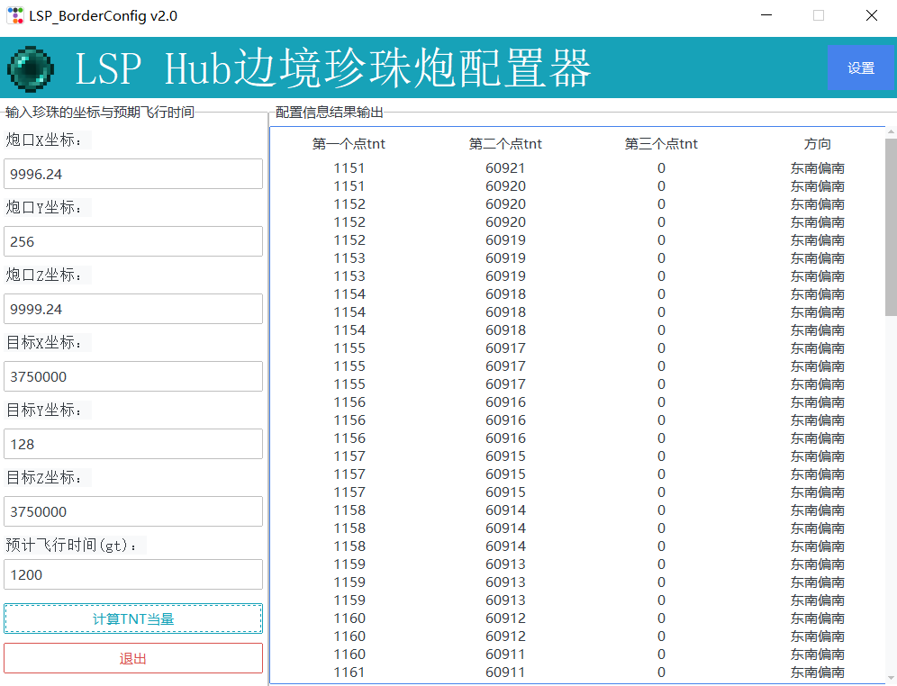
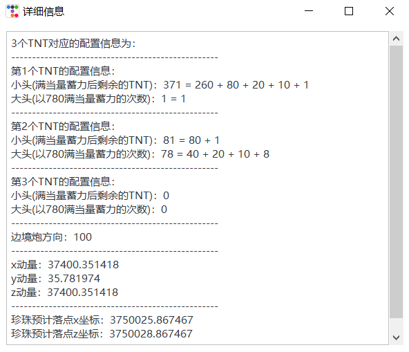

# 使用指南
>写在前面：
>
>这是为LSP服务器边境珍珠炮定制的配置计算器，仅适用于LSP边境计划。

### 1. 向左侧的输入框中填写珍珠初始位置，目的地坐标，以及预计到达时间

### 2. 填写完成后点击“计算TNT当量”，右侧会显示计算结果，这里以前往主世界东南边境为例

### 3. 在右侧的表格中任意选择一行，将会弹出该条配置的详细信息

​		接下来，你就能根据详细信息中的指示为边境珍珠炮配置TNT了。需要注意的是，配置方向时，从左往右进行（玩家面朝告示牌）

### 4. 修改默认值

​		相信你一定注意到了输入框内的默认值。如果你改变了整台珍珠炮的位置而不想每次重新输入初始位置，请点击右上角的“设置”按钮，点击后会弹出如下的界面：

相应输入新的默认值，点击“应用”按钮即可，更改后的默认值将会保存，设置即时生效。

## 接下来，准备好前往探索更加遥远的世界吧🎉🎉🎉